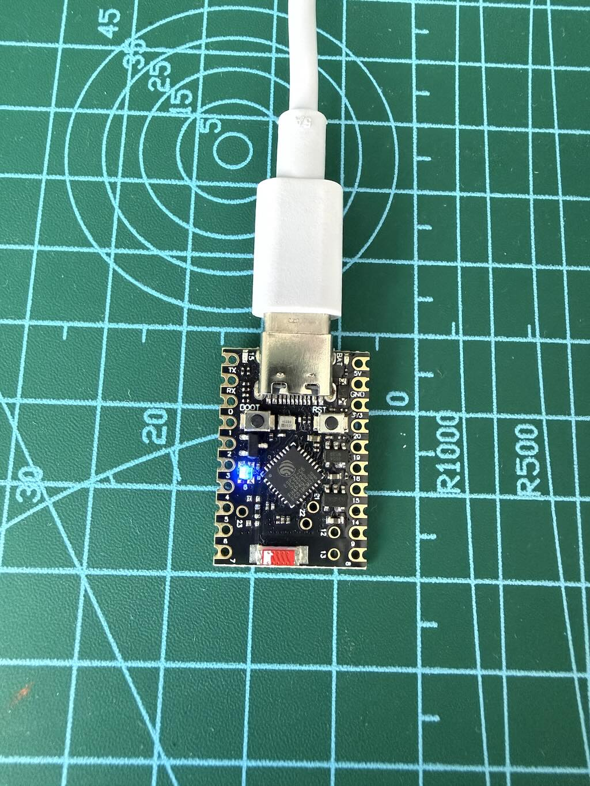
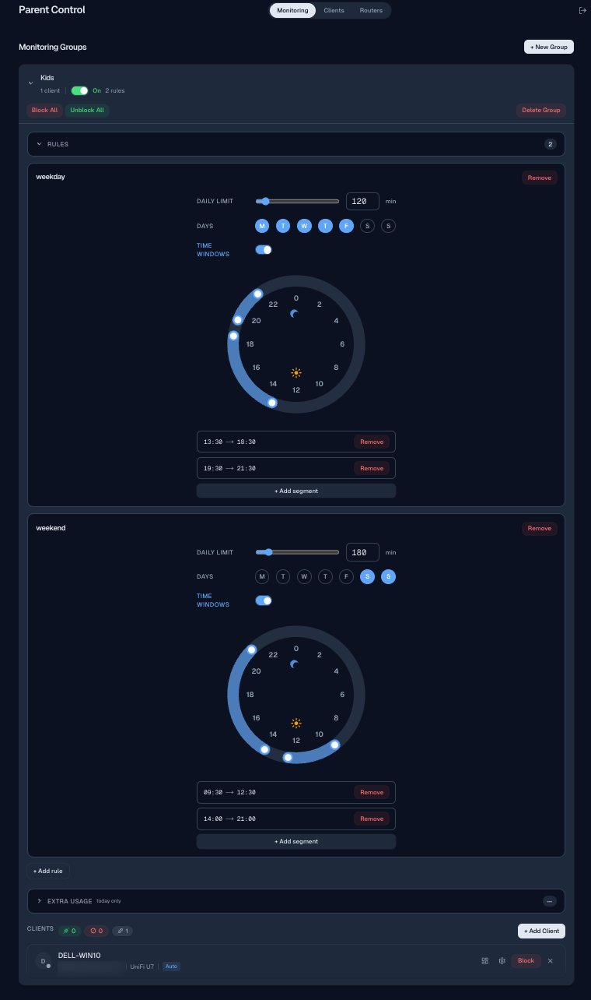
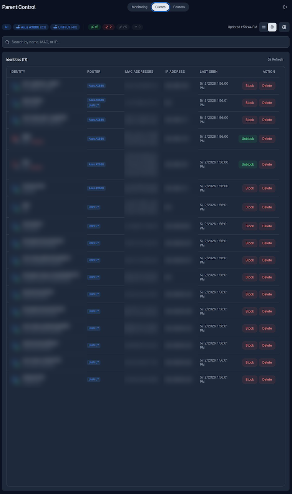
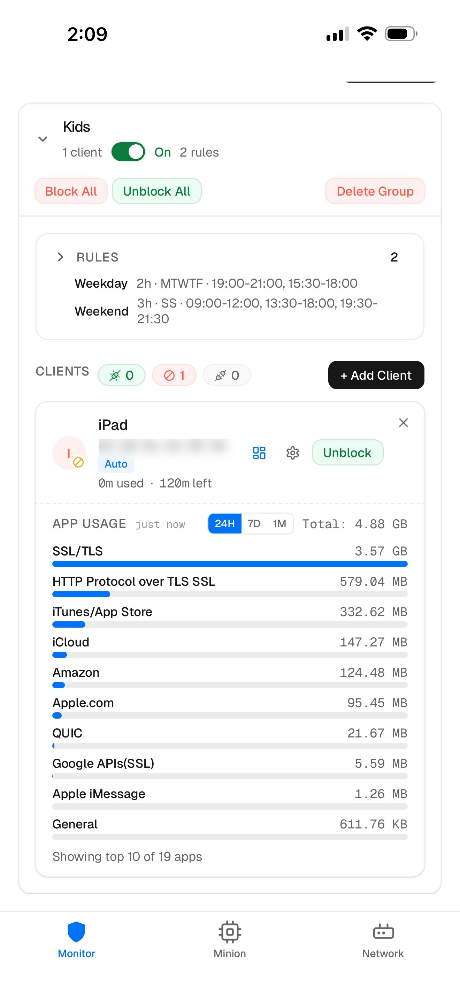
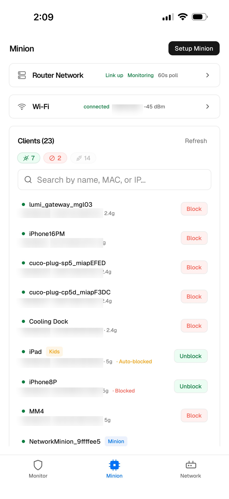

# NetGuardian — Internet Connection Control Demo

> Daily internet-time control for the routers families already own.

A portfolio project that ships **two ways to enforce a per-child daily online-time budget** without replacing the home router, enrolling every device, or learning network jargon:

1. **Web App** — a self-hosted parental-control console that drives the router directly from a server.
2. **ESP32 Companion Device + Mobile App** — an affordable hardware "Minion" plus an iOS-style app, for households that own a router but no server.

Both deliver the same parent-facing experience: pick a kid's devices, set a daily time budget, and let the system auto-block at the network layer when the budget is spent.

<p align="center">
  
</p>
<p align="center"><em>The Minion — a USB-powered ESP32-C6 board.</em></p>

---

## Why this exists

School-age kids spend more time online than any prior generation, and most can't reliably regulate how long they stay on. Parents don't want to ban devices — they want a **daily time budget that holds**, configured once.

The existing options each fall short on at least one axis:

| Approach | Why it falls short for most families |
|---|---|
| **Built-in router parental control** (Xiaomi / Huawei / TP-Link admin pages) | Buried in admin UI; per-MAC; time-window only, no daily budget; UX differs by vendor. |
| **System-level limits** (iOS Screen Time / Family Link) | Must enroll every device. Cross-platform homes fragment. Easy to bypass on a borrowed device. |
| **Specialty network boxes** (Firewalla, Gryphon, Circle) | Expensive. Steep setup. Often requires replacing the router. |
| **Replace the home router** | Wi-Fi quality regression. Family-wide disruption. |

There is a clear gap: **a tool that takes five minutes to set up, enforces a daily time budget at the network layer, and leaves the existing home router in place.** NetGuardian targets that gap from two angles.

---

## Two delivery modes, same feature set

### Mode A — Web App (standalone, server-deployed)

A browser-based parent console. Runs on any always-on machine (mini-PC, NAS, home server) and talks directly to the router's admin API.

<table>
  <tr>
    <td align="center"></td>
    <td align="center"></td>
  </tr>
  <tr>
    <td align="center"><em>Monitoring &amp; Rules</em></td>
    <td align="center"><em>Identities</em></td>
  </tr>
</table>

- Dark-mode console for setting groups, rules, and time windows.
- Two rules can stack per group — e.g. stricter weekdays, relaxed weekends.
- Identities tab consolidates every device the router has seen, with block/unblock per-MAC.

### Mode B — ESP32 Companion + Mobile App

For the majority of households that own a router but no server. The Minion is a thumb-sized ESP32-C6 board that joins the home Wi-Fi over Bluetooth pairing, then runs the same control loop on-device.

<table>
  <tr>
    <td align="center"></td>
    <td align="center"></td>
  </tr>
  <tr>
    <td align="center"><em>Monitor (per-child usage)</em></td>
    <td align="center"><em>Minion (network &amp; clients)</em></td>
  </tr>
</table>

- **Plug in** — Minion joins your Wi-Fi via Bluetooth pairing in the app. No re-cabling, no new SSID.
- **Auto-discover** — Minion identifies every device on the network; label them to a kid once.
- **Set a daily budget** — e.g. "Up to 2 hours per day on weekdays." That's the whole rule.
- **Auto-block on overage** — When the budget is hit, the Minion pushes the kid's MACs into the router's filter list. The mobile app reflects state within ~2–12s. At midnight, the counter resets and the block lifts automatically.

---

## How it works

Both modes follow the same loop:

1. **Discover** every client on the LAN through the router's admin API.
2. **Poll** the router every ~60s and credit each tracked client's used-today counter.
3. **Enforce** when a child crosses the budget by pushing their MACs into the router's MAC filter list — no client-side software, can't be bypassed by reinstalling.
4. **Reset** counters at midnight; auto-blocks lift on their own.

**Network-layer enforcement** is the design choice that distinguishes this from screen-time apps. Block lists live in the router's filter, so a borrowed device or fresh OS install doesn't bypass the rule.

### Supported routers

Drives the existing router via vendor admin APIs:

- UniFi
- Asus
- Xiaomi MiWiFi *(in development)*
- Huawei HiLink *(in development)*
- TP-Link XDR / AX *(in development)*
- OpenWrt *(in development)*
- Tenda *(in development)*

---

## Repository layout

This portfolio repo bundles three sibling projects via symlinks under `code/`:

```
code/
├── InternetConnectionControlWebApp/         # Mode A — standalone web app (server-deployed)
├── InternetConnectionControlEsp32Firmware/  # Mode B — ESP32-C6 firmware (ESP-IDF)
└── InternetConnectionControlMobile/         # Mode B — mobile companion app
```

> The three product repos may be kept local-only or moved to private GitHub repos. This portfolio repo exists to present screenshots, the device photo, and the product story in one place.

---

## Hardware

- **MCU:** ESP32-C6 (Wi-Fi 6 + Bluetooth 5 LE, RISC-V)
- **Power:** USB-C, ~5 V

---

## Status

Working prototype across all four codebases. UI shown above is from the running web app and iOS app; the Minion photo is real hardware.
